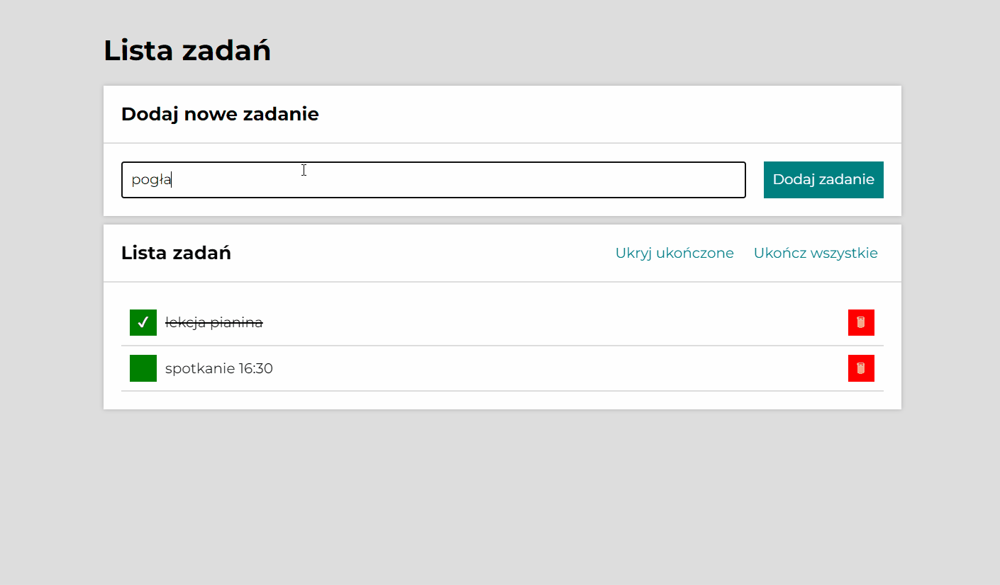

# To do list

Hi! This is a simple to do list website I created as part of learning web applications in pure JavaScript.

The user can write a task and press the button to add it to the list. 
In the application you can also tick a completed task and delete it.

## Demo

[dondeptu.github.io/to-do-list/](https://dondeptu.github.io/to-do-list/)

## Preview

## Technologies
Project is created with:

